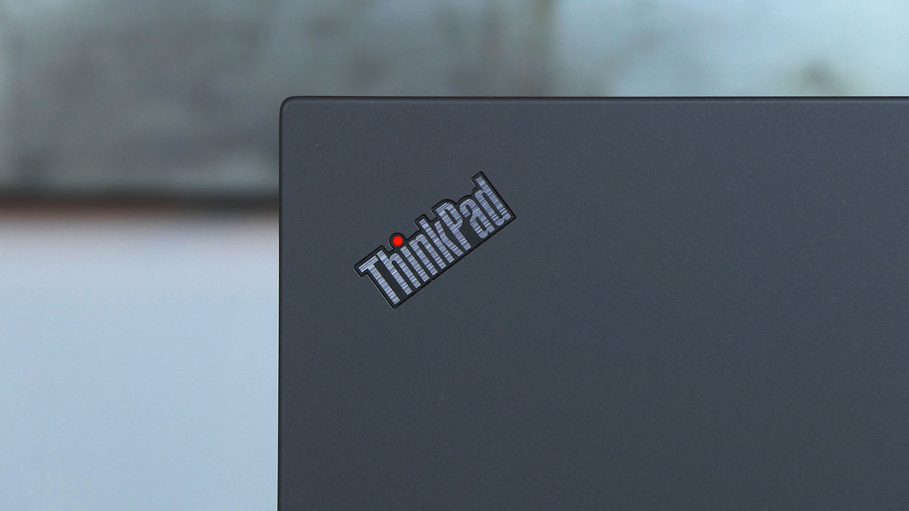

 

What year is it again? 26? I haven't left the terminal long enough to notice — my system clock drifted and I only just caught it. Anyway, hello to all the engineers out there, junior and senior, and of course to my fellow Linux nerds.

In this post I want to break down what hardware is actually worth buying if you're a programmer, a Linux user, a sysadmin, a technical writer (like me, ha), or a manager. I'll throw gamers a bone too, but consider that section a footnote — I'm not much of a gamer myself, though I did once have to sit inside a game engine for work, so I've earned the right to an opinion.

Before we get into the actual picks, let's lay out the facts and the needs of each of these roles. Everyone has different priorities, sure, but they overlap more than people think — and once you strip away the marketing copy, the actual requirements for "good machine to work on" are almost identical across all of them.

I've spent a genuinely unreasonable amount of time comparing processors, GPUs, and laptops across brands — corporate, flagship, gaming, all of it. I've read the spec sheets, I've read the community threads where people complain about coil whine at 2am, I've watched the durability teardown videos so you don't have to. Here's what actually matters, in order.

## The Keyboard Comes First. Always.

For every single one of these roles — coder, writer, sysadmin, manager — you need a keyboard you *want* to type on. And here's the uncomfortable truth about the current market: most of it is 1.5mm, 1.3mm, sometimes less. Can you write on that? Sure. It's a solid "okay." It exists to let you exist. It's not going to hurt you, and it's not going to inspire you either.

If you actually want a keyboard that makes typing feel good, your options collapse fast: **ThinkPad** (not every line — pay attention, this matters more than you'd think) and, to a lesser extent, select **Dell Latitude** models. And that's basically it. If you're on desktop, obviously the market opens wide up — you can buy something that clacks like a 1985 typewriter if that's your thing, mechanical switches, hot-swappable, the whole ritual.

Why does this matter so much for these particular jobs? Because a writer writes text all day. A Linux user is constantly fixing configs, running `fastfetch` in their terminal just to feel something. A sysadmin is deep in Docker configs and SSH sessions, typing constantly, half the time over a flaky VPN tunnel at 2am because production decided to have opinions. A developer is fixing bugs, replying to painfully dumb emails, arguing in Slack with coworkers about tabs versus spaces for the hundredth time. It's all typing. The keyboard is the interface to your entire professional life — treat it like one, not like an afterthought bolted onto a chassis to check a box.

## The Screen: Second Priority, First for Some

If your work touches design, video, or imagery, a good display isn't optional — it's oxygen. ThinkPad P-series and select T-series configurations cover this too: OLED, 2K/4K, 16:10, no problem. Just know that the panels with the nicest color and contrast tend to come on the models where key travel has already crept down toward that 1.5mm territory. Nothing is free — every laptop is a stack of compromises, and your job is to pick which compromises you can live with.

If your priority is design work *and* raw power *and* you're constantly traveling — because let's be honest, rendering 4K footage makes any laptop sweat — then a MacBook on an M-series chip is a legitimate outlier worth considering, purely on the merits of thermal efficiency and color accuracy per watt. It's not Linux, and yes, you'll spend a weekend re-training your muscle memory if you're coming from a tiling window manager. But nobody serious is pretending Apple Silicon isn't good hardware. Just don't buy the oldest chip on the shelf because it's the cheapest — buy something current, or at minimum one generation back. Old silicon for the sake of saving two hundred bucks is how you end up bottlenecked in eighteen months.

## CPUs: Just Buy AMD, Especially on Linux

I'll say it plainly: AMD is the better call, particularly if you live on Linux. Open drivers, better long-term support, a healthier open-source relationship, strong new architectures, decent battery life, and — unlike certain competitors — they don't turn your lap into a stovetop by hour two.

Core count matters more than clock-speed bragging rights:

- **6 cores / 12 threads** — the bare minimum for comfortable daily work. Fine for scripting, light web dev, general sysadmin tasks.
- **8 cores / 16 threads or more** — where you actually want to be if your day involves compiling, running heavier Docker containers (RAM matters here too), databases, or a background full of questionable `systemd` units doing who-knows-what while you're trying to focus.

So why the cold shoulder to Intel? It's not personal — it's architectural. Their recent generations look exciting on paper: new process node, more cores, an NPU nobody asked for. But *what kind* of cores? P-cores and E-cores. So you look at a spec sheet that says "10 cores, 12 threads" and think you're getting a beast, except only 4 of those cores are the real performance ones and the rest are efficiency cores doing background busywork. Compile something heavy on that setup and you'll feel the difference immediately compared to a chip with 8 full, real, performance cores across the board that don't need to negotiate with the scheduler about who gets to do actual work.

This isn't an "Intel is bad" take — for pure single-thread desktop work with light multitasking, their newer chips are fine. But for sustained, parallel, compile-heavy, virtualization-heavy workloads on a laptop that also has to survive a battery-only train ride, AMD's approach is currently just a better fit for how we actually work.

## RAM: The Single Biggest Priority

Minimum 16GB. Realistically 24–32GB. Why? One word: **Electron.**

Most of the apps we use daily are Electron shells with a full Chromium instance riding shotgun inside them, quietly drinking your memory like it's an open bar. Is the result nice? Sure, the design and styling are genuinely great, cross-platform consistency is genuinely convenient for the people building these apps. Does it cost you dearly in resources? Also yes, painfully so. Browsers in general (any engine that actually runs JS) eat more RAM than should be legal, and Discord — which is Electron through and through — will happily consume everything you give it on its own, no roommates required, no apology given.

If you run a browser with two dozen tabs, a couple of Electron apps, a Docker stack, and an IDE with a language server chewing through your codebase — 16GB is a *survival* number, not a *comfort* number. 32GB is where you stop thinking about memory pressure and go back to thinking about your actual work. If you can afford it and your workflow includes VMs or multiple containerized services running locally, don't be shy about going higher. RAM is one of the few upgrades that pays for itself in reduced daily frustration almost immediately.

## Storage: Don't Cheap Out on the One Part You'll Never See

NVMe SSD, non-negotiable, minimum 512GB if you're a developer running multiple project directories, Docker images, `node_modules` folders that multiply like rabbits, and language toolchains that all insist on their own isolated environments. If you do anything with local ML models, containers, or VMs, go 1TB. Rotational drives died for a reason — let them rest in peace, they served their purpose in an era that is not this one.

One practical note: if you're buying a ThinkPad T or P series, check whether the SSD is user-replaceable before you buy. On most of these lines it still is, which means you can start at a reasonable storage tier and upgrade later instead of overpaying the manufacturer's storage markup on day one. That flexibility alone is worth factoring into the price comparison.

## What *Not* to Buy (and Why)

This is the part of the post where I stop being diplomatic. Every category above tells you what to look for. This section tells you what to walk past in the store, no matter how nice the marketing photo looks.

### Dell XPS (and its consumer-ultrabook cousins)

The XPS is the laptop world's answer to "what if we made a MacBook Pro, but beige-brained." It's a flagship consumer ultrabook, frequently benchmarked against the MacBook Pro, and on a shelf under store lighting it looks genuinely great. The screen is usually excellent.

Here's why it's still not our pick:

- **Keyboard**: Perfectly fine for a normal person writing emails. Not ThinkPad-tier. Shorter travel, mushier feedback, and after eight hours of real work you'll feel the difference in your fingers.
- **Repairability**: RAM is frequently soldered, the battery is a project to replace rather than a five-minute job, and the chassis isn't exactly inviting you to open it up.
- **Ports**: Increasingly dongle-dependent. Standard USB-A and Ethernet are treated as optional extras rather than baseline expectations.
- **Price**: You're paying a premium for the industrial design. For the same money you could get a ThinkPad with enough RAM to run a small datacenter and still have cash left for a proper docking station.
- **Thermals**: Manufacturers keep cramming increasingly powerful Intel chips into increasingly thin chassis, which means fan noise and thermal throttling the moment you ask it to do something for longer than five minutes.

If you want a good-looking laptop for coffee shops and PowerPoint demos, the XPS will make you happy. Just don't try to compile a kernel on it — your fingers, and your ears, will file a formal complaint against the fan noise.

### ASUS, Acer, and HP (the mass-market consumer lines)

This is where roughly ninety percent of the "consumer laptop" market actually lives, and it's also where most of the disappointment lives.

- **Keyboard**: This is exactly the 1.0–1.3mm travel we talked about earlier, frequently paired with creaky plastic, backlighting that's somehow both too dim to be useful and too bright to ignore, and key legends that start wearing off within six months. A keyboard that exists purely so that a keyboard technically exists.
- **Chassis**: Plastic, flexy, occasionally rattly. Hinges start feeling loose within a year of normal use.
- **Screens**: Often TN panels, or IPS panels that technically qualify as IPS while offering color coverage and brightness that make you question the term.
- **Build quality and QC**: A genuine lottery. Two units off the same production line can feel like different products.
- **Cooling**: Close to nonexistent on the budget and mid-range models. Some of these throttle running a "Hello, World" compile.

If you go with a consumer-line ASUS, Acer, or HP, budget accordingly: the keyboard will start squeaking before you finish typing your first "Hello, World," and the screen will be actively working against you while you try to read logs at 1am. There are exceptions in their business lines, but the consumer segment is not where you go looking for a daily driver.

### Gaming Laptops (Legion, ROG, Razer Blade, and friends)

I touched on these briefly before, but they deserve their own paragraph of roasting, because the mismatch between "gaming laptop" and "daily dev machine" is almost comedic once you actually live with one.

- **Aesthetics**: Looks like a children's toy that got into steroids, glows every color of the rainbow, and generally screams about its own power to anyone within eyeshot — including in the middle of a client call.
- **Battery life**: Lives about three hours away from an outlet, and turns into a paperweight faster than you can get Docker Desktop to finish starting up once it's unplugged.
- **Weight and portability**: Heavier than your cat, and somehow heavier still than your conscience after a Friday-evening production deploy.
- **Price**: You're paying full price for a GPU you don't need for software development, plus an RGB subsystem that will annoy your coworkers on a call far more than it will inspire you at your desk.

If you're a genuine gamer who also happens to code, fine, there's a real argument for a Blade or a Legion — just go in with eyes open about the trade-offs. If you're buying it purely because it *looks* powerful, you're paying a premium for a light show.

## The Actual Recommendations for 2026

Here's where I put my money where my sarcasm is. **ThinkPad T and P series are the backbone of this list** — they're the machines built around exactly the priorities we've walked through: real keyboards, serious durability, sane thermals, and broad Linux compatibility, several of them formally certified for major distributions rather than just "should probably work." The **L and E series exist as the honest budget compromise** — you give up some polish and some display options, but you keep the ThinkPad DNA: the keyboard feel, the build quality, the repairability. That's a much better trade than saving the same money on a consumer-line ASUS or HP and losing all three.

**For developers who live in Linux and want the best keyboard-to-power ratio:**
A **ThinkPad T-series AMD** configuration is the sweet spot — Ryzen AI PRO silicon, a keyboard that doesn't apologize for existing, and enough balance for daily dev work without workstation pricing. If you need more screen real estate for a multi-pane coding setup, the larger 16-inch T-series models give you that at the cost of a bit more weight in your bag. Most current T-series configurations run mainstream Linux distributions without drama — Ubuntu, Fedora, and Debian derivatives all behave themselves on this hardware, which is exactly what you want when your job depends on your tools not fighting you.

**For heavier local workloads — ML, CAD, big compiles, scientific computing:**
Look at the **ThinkPad P-series AMD** line. These are ISV-certified workstation-class machines that let you push RAM capacity well beyond what the T-series offers. They're more expensive for comparable core specs, and some configurations run their fans hard under sustained load — but if you're compiling all day, running local models, or doing simulation work, that extra headroom pays for itself.

**For the budget-conscious who still want the ThinkPad DNA:**
The entry-level **ThinkPad L-series and E-series** bring genuine ThinkPad durability and keyboard feel without the flagship price tag. You lose the OLED option and some of the chassis polish, but the bones — the keyboard, the build quality, the general "this thing will survive being dropped in a hallway" attitude — are the same family. This is the honest, no-shame compromise pick, not a downgrade to avoid.

**For design, video, and "I travel constantly and it has to just work":**
MacBook Pro on an M-series chip. Buy something current, or at most one generation back — don't start with the oldest chip on the shelf just because it's the cheapest, you'll regret it in under two years. Yes, it's not Linux, and yes, you'll fight your muscle memory a little if you're coming from a tiling window manager and full shell control. But for color-accurate displays, battery life, and render performance per watt, this is the one non-ThinkPad exception on the list that earns its place.

**A quick honorable mention for the Linux purists:** if repairability and long-term upgradeability matter more to you than brand pedigree, it's worth putting a modular, community-favorite laptop brand on your shortlist — the kind built specifically around swapping your own ports, upgrading your own RAM, and running the same chassis for a decade. Not quite ThinkPad-tier keyboard, but the philosophy will resonate with anyone who already runs Arch "btw."

## And for the Gamers, Since I Promised

I don't play much, but I've had to sit inside a game engine long enough to have an opinion: if gaming is genuinely your priority and coding is secondary, go in with eyes open about everything covered in the roast section above — the battery life, the weight, the noise. Just don't pretend to yourself that you're buying it "for development." You're buying it for the GPU, and that's a perfectly fine reason, as long as you're honest about it.

## Bottom Line

Buy the keyboard first, mentally. Everything else — the CPU, the RAM, the screen — is a variable you tune around that constant. AMD if you're on Linux and value your battery and your sanity. 32GB of RAM if Electron apps are anywhere near your daily workflow (they are, don't lie to yourself). NVMe, always, and enough of it that you're not managing storage like it's 2010. A discrete GPU only if you actually need one, not because it's there.

Stick to ThinkPad T or P series if you can afford them, L or E series if you can't and refuse to compromise on build quality — and steer hard around the consumer-flagship trap of Dell XPS, the budget-plastic lottery of mass-market ASUS/Acer/HP, and the RGB tax of gaming laptops, unless you actually need what those specific categories are built for.

And if your current laptop still has a keyboard you enjoy typing on — for the love of all that's holy, don't "upgrade" into something worse just because it's newer. New isn't always better. It's just newer.

i use arch btw :>
